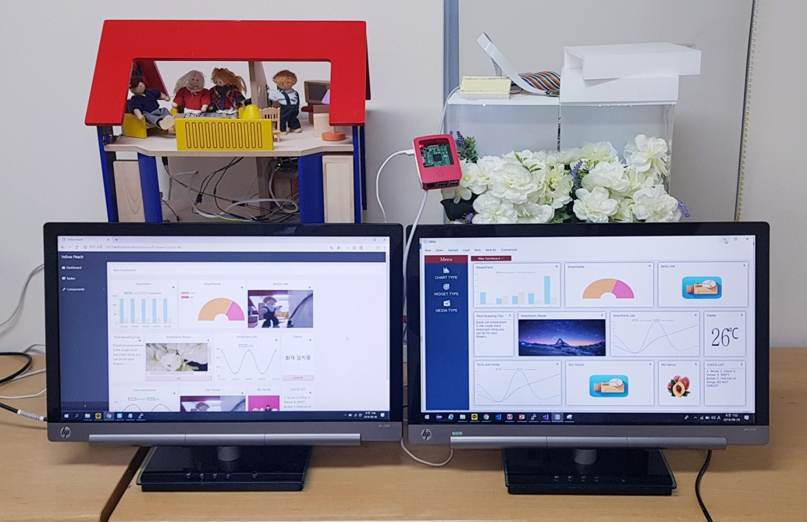

# YellowPeach IoT Dashboard

YellowPeach is a project that allows easy and fast creation of dashboard applications and virtual IoT devices.

## Project Overview

Every IoT system requires a dashboard application to monitor the status of IoT sensors or devices in the form of charts or graphs. This project provides a system called YellowPeach to easily create such applications.

## Key Features

- **Dashboard Application Creation**: YellowPeach includes an authoring tool that allows the quick and easy creation of dashboard applications through a menu-based approach.
- **Virtual IoT Device Emulation**: YellowPeach provides the ability to emulate virtual IoT devices for scenarios where a real IoT system is not available.
- **Portable Server**: The YellowPeach server is implemented on Raspberry Pi 3 to enhance portability.
- **Various Components**: The server includes MQTT broker, database, viewer program, and virtual IoT device emulator.
- **Web Viewer Program**: Developed a viewer program accessible from any web browser for user convenience.

## System Configuration

The YellowPeach system consists of the following components:

- **Dashboard Authoring Tool**: A tool for quickly creating dashboard applications.
- **Virtual IoT Device Emulator**: An emulator for generating virtual sensor values when a real IoT system is not present.
- **Raspberry Pi 3 Server**: A portable server with all the components of the system.

## Test IoT Application System

The test IoT application system developed to validate the overall operation of YellowPeach is implemented with two systems: a smart farm and a smart home.

## Awards and Achievements

**2$^{nd}$ Prize in the 16th Embedded Software Competition, Ministry of Trade, Industry, and Energy**
- Date: Dec 2018
- National-wide Development Competition

**Gold Prize in the 14th Hansung Engineering Competition, Hansung University**
- Date: Oct 2018

## Interviews and Video Links
- Introduction Video: [Video Link](https://youtu.be/d1gSSu9ziXg)
  
** Interview for Winners of the 14$^{th}$ Hansung Engineering Contest**
- MoneyToday (1:17 - 1:57): [YouTube Link](https://www.youtube.com/watch?v=S7IDEu4fIyc)

** Interviews for Winners of the 16$^{th}$ Embedded Software Competition**
- AsiaToday: [AsiaToday Link](http://www.asiatoday.co.kr/view.php?key=20190102010000958)
- MoneyToday: [MoneyToday Link](http://news.mt.co.kr/mtview.php?no=2019010209507455004)
- E-Daily: [E-Daily Link](https://m.edaily.co.kr/news/Read?newsId=03109446622354112&mediaCodeNo=257#forward)
- The JoongAng: [The JoongAng Link](https://news.joins.com/article/23255264)

